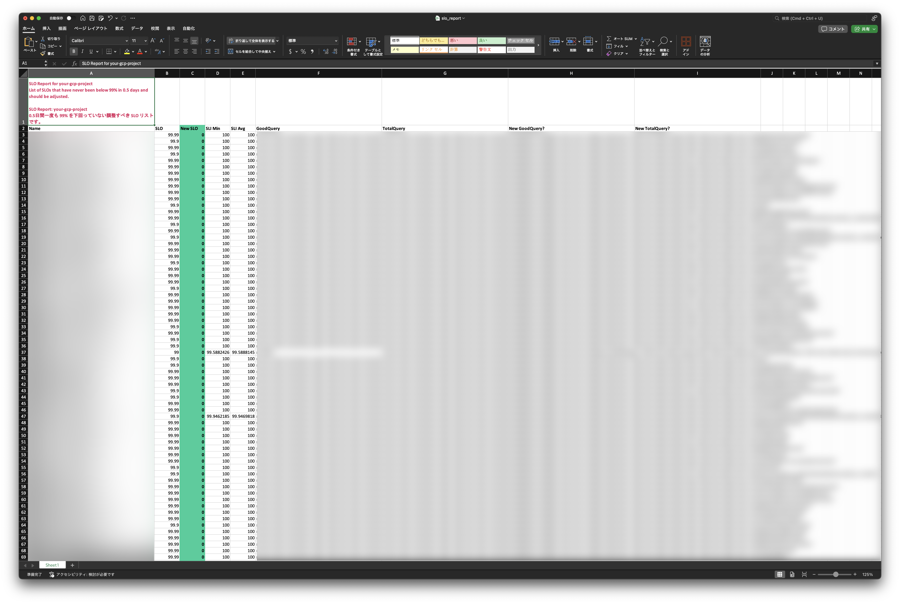

<strong>Vigil</strong> identifies underutilized service-level objectives in GCP environments by detecting SLOs that consistently maintain error budget thresholds,generating actionable Excel reports with historical performance trends and optimization recommendations.

## Features
- Obtain a list of SLOs for which the error budget has never been below n% for m days and for which the adjustment is to be made.
- Obtain a list of SLOs for which 50% of the total window has a negative error budget.
- Excel report generation
- Multi-cloud SLO monitoring (currently supports Google Cloud Monitoring)



## Arguments
```
--cloud string
      cloud provider. currently supports "gcp" (default "gcp")
--gcp-project string
      GCP project id
--error-budget-threshold float
      error budget threshold. 0 ~ 1 (default 0.9)
--window duration
      target window. use "h" suffix (default 720h0m0s)
```

### Get a list of SLOs to be adjusted that have never been below 99% in 30 days
```bash
$ vigil --cloud gcp --gcp-project your-gcp-project-id --error-budget-threshold 0.99 --window 720h
```

## Install
```bash
$ go install github.com/rluisr/vigil@main
```

## Coming Soon
- Datadog integration
