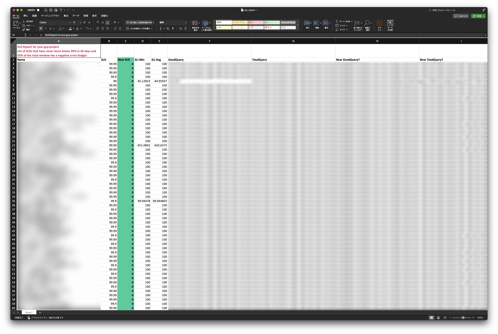

**Vigil** identifies underutilized service-level objectives by detecting SLOs that consistently maintain error budget thresholds, generating actionable Excel reports with historical performance trends and optimization recommendations.

[日本語版 README はこちら](./README_ja.md)

## Features

- Detect SLOs where the error budget has never dropped below a configurable threshold over a given window
- Detect SLOs where 50% or more of the total window has a negative error budget
- Excel report generation with styled output (`slo_report.xlsx`)
- Multi-cloud SLO monitoring
  - Google Cloud Monitoring
  - Datadog
- i18n support for report output (English / Japanese)



## Install

```bash
go install github.com/rluisr/vigil@main
```

## Authentication

### GCP

Vigil uses [Application Default Credentials (ADC)](https://cloud.google.com/docs/authentication/application-default-credentials). Ensure credentials are configured:

```bash
gcloud auth application-default login
```

### Datadog

Set the following environment variables:

```bash
export DD_API_KEY="your-api-key"
export DD_APP_KEY="your-app-key"
```

## Usage

### Arguments

```
--cloud string
      cloud provider: "gcp" or "datadog" (default "gcp")
--gcp-project string
      GCP project ID (required for GCP)
--dd-site string
      Datadog site (e.g. datadoghq.com, ap1.datadoghq.com, datadoghq.eu)
--error-budget-threshold float
      error budget threshold, 0 to 1 (default 0.9)
--window duration
      target window, use "h" suffix (default 720h0m0s)
--lang string
      report language: "en" or "ja" (default "en")
```

### Examples

#### GCP: Find SLOs that never dropped below 99% in 30 days

```bash
vigil --cloud gcp --gcp-project your-gcp-project-id --error-budget-threshold 0.99 --window 720h
```

#### Datadog: Find SLOs that never dropped below 95% in 14 days

```bash
vigil --cloud datadog --dd-site datadoghq.com --error-budget-threshold 0.95 --window 336h
```

#### Generate a Japanese report

```bash
vigil --cloud gcp --gcp-project your-gcp-project-id --lang ja
```

## License

WTFPL
